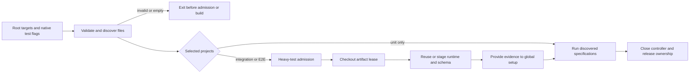

# Draft: Workspace-Aware Focused Tools and Test Builds

- **Origin:** `USER-INBOX § Errand`, reclassified at the 2026-07-21 housekeep drain after repeated focused-test and
  lint retries across `cli-command-inputs` and `markdown-formatting`.
- **Purpose:** A focused repository-root command selects the intended tests and reliably runs them against the
  current code, including build reuse and publication. Focused lint commands use the same root-relative path
  convention.
- **Readiness:** Settled design for draft-capture review. The accepted goal, invocation contract, runtime-build
  policy, artifact lifetime, and input identity are composed below.

---

## Scope Amendment — 2026-10-03

The initial purpose was: “Make focused test and lint paths passed from repository-root scripts resolve predictably
across the npm workspace boundary.” The original mechanism fork was generic argument normalization versus dedicated
focused helpers. Dedicated helpers with repository-relative operands are now the accepted direction; package-local
commands retain package-relative invocation.

The accepted scope now includes focused selection across unit, integration, and E2E, literal test-flag forwarding,
and the build freshness and publication contract those consumers need. The path/flag and core build concerns in
`draft-e2e-build-coordination.md` are design inputs to this expanded concern. Their ownership cleanup is routed through
the identity-global inbox for isolated planning closeout; the provisional source stub is unchanged in this checkout.

Runtime builds plus generated schemas suffice for test execution. Declaration generation remains in the existing
full `npm run build` quality gate. This intentionally replaces ordinary E2E setup's full-build requirement, rather
than treating a fast build as evidence that declarations were generated.

Supported integration/E2E runs own their checkout's artifacts until the controller finishes. Manual builds in that
checkout queue behind the run; separate worktrees remain independent. This was chosen over per-run snapshots.

The resulting design estimate is `Heavy`: cross-process artifact lifetimes and complete freshness evidence need
design before implementation. The meta's `Class` write belongs to the draft-capture ceremony.

## Problem / Motivation

The complete focused-test path has three failure points: selecting files across the workspace boundary, preserving
test flags across npm delegation, and ensuring that subprocess tests receive current, available build artifacts.
Fixing only one leaves a valid-looking root command able to select nothing, run more tests than requested, rebuild
unnecessarily, or race a build that removes its CLI entry point.

The root invocation contract must also cover focused TypeScript lint. Markdown already has a usable literal-path
helper; this plan incorporates that behavior instead of adding a replacement.

## Current Source Behavior — Checked 2026-10-03

- Root `package.json:scripts["test:unit"]` delegates to npm in the workspace. Passing the repository-relative
  `packages/arc-framework/__tests__/unit/template/recipe.test.ts` finds no files; passing
  `__tests__/unit/template/recipe.test.ts` runs 32 tests. With the package-relative path, one npm separator followed
  by `-t` runs all 32, while an additional separator preserves the filter and runs one.
- `vitest.config.ts:packageRoot` pins the project roots to the package directory. A direct root Vitest invocation
  with that config, a repository-relative test path, and `-t` runs the intended one test. This is invocation
  substrate, not a replacement for heavy-test admission.
- `runLocalVitestTier` already passes filters and flags through Vitest's `parseCLI` and preserves its controller
  lifetime for run mode. `withLocalHeavyTestAdmission` surrounds the controller for the heavy package-script routes;
  its repository-common slot serializes local heavy runs and has explicit CI and experiment bypasses.
- `selectE2EBuildCommand` chooses the fast build only for the npm lifecycle name `test:e2e:focused`. E2E `setup`
  otherwise builds in full, and integration `setup` builds fast. Both skip building for `ARC_E2E_SKIP_BUILD=1`, then
  check that `dist/cli.js` and `dist/schemas/kernel.json` exist. They do not prove reuse freshness.
- `baseOptions` cleans its output, bundles the CLI, emits metadata, and runs `writeKernelSchemaArtifact` with
  `createProductionSchemaRegistry` before `writeDevBuildStamp`. `fastOptions` changes declaration emission only.
- `createDevCheckDeps`, `selectBundleInputs`, and `hashSourceInputs` establish freshness from the previous CLI
  bundle's first-party TypeScript graph. `writeDevBuildStamp` hashes files after generation. The current stamp
  omits build configuration and dependency identity, and can certify changed source that a compiler read earlier.
- Installed `esbuild.build` can resolve an unchanged `./dep.js` import to `dep.ts`, then to newly added `dep.js`.
  A disposable probe changed the bundle while the old input digests stayed unchanged. TypeScript's `createProgram`
  still selected `dep.ts` with both files present; tsup's `loadTsupConfig` uses `bundleRequire`, whose esbuild
  metadata exposes the runtime-resolved input paths through `dependencies`.
- `esbuild.build` records a symlink's resolved source in its input metadata, and `bundleRequire.dependencies`
  inherits those paths. Retargeting an internal link can change output while the old input digests and path
  membership stay unchanged. `esbuild.build` also consumes nested `package.json` resolver controls such as
  `sideEffects` without listing those manifests as inputs; changing that field can change emitted runtime effects.
- `createProductionSchemaRegistry` composes schema families outside the CLI entry graph. The current CLI metafile
  does not include `src/production-schema-registry.ts`; a CLI-input stamp alone cannot establish schema freshness.
- `runFastDevBuild` already creates unique staging output through `DEV_BUILD_OUTPUT_DIRECTORY_ENV`.
  `promoteStagedDevBuild` renames ancillary files, then the CLI, then the stamp. It preserves entry-file visibility,
  but neither serializes all builders nor atomically replaces the complete artifact set.
- Root `package.json:scripts["lint:ts:file"]` keeps ESLint in the package directory. The repository-relative recipe
  test path fails and the package-relative path passes. `eslint.config.js` and its suppression record depend on
  package-relative invocation. Root `package.json:scripts["lint:md:file"]` uses `--no-globs`; a named meta file
  produces exactly one linted file and zero errors.
- Vitest's public `createVitest`, `getRelevantTestSpecifications`, `standalone`, and `runTestSpecifications` support
  discovery followed by execution in the same controller. A source-grounding probe ran exactly one recipe case and
  exposed root `provide` evidence through the selected project's `getProvidedContext`, with package cwd retained.
  A second probe with an unmatched name filter reported 32 skipped cases and native exit zero; empty filename
  selection and zero completed cases need distinct handling.
- Installed Vitest 4.1.8's `Vitest.close` logs global-setup teardown errors and asynchronous resource-close
  rejections through `Logger.error` without rejecting or setting `process.exitCode`; `Vitest.exit` delegates to
  `close`. A disposable controller probe reproduced that behavior. The public `Vitest.logger` and `Logger.error`
  support scoped observation of the closing interval while retaining the native log output.
- `PoolRunner.stop` records worker teardown errors through `StateManager.catchError` while resolving shutdown.
  `Vitest.runFiles` checks unhandled errors before closing; public `state.getUnhandledErrors` can contain a later
  `Teardown Error` even when `close` resolves and no closing error is logged. A disposable passing-case probe
  reproduced that path with native exit zero.

## Resolved Direction

### Dedicated root helpers

Use dedicated focused entry points rather than rewriting every root script's generic forwarding. Repository-root
helpers receive repository-relative targets; package-local scripts continue to receive package-relative targets.
The distinction is explicit, with no root helper guessing which base a relative operand meant.

The focused test entry invokes the Node adapter directly from the root, avoiding a second npm argument parse. Reuse
Vitest's parser for test flags and its existing project configuration for the unit/unit-mocks split. Paths and
selection must be established before taking a heavy-test slot or requesting a build. An invalid target or empty
selection fails visibly instead of producing a successful empty run.

Preserve the existing Markdown literal-path and fix helpers. Adapt TypeScript lint at its focused boundary while
keeping ESLint's package working directory and suppression semantics.

Align `QUICK-REFERENCE.md` focused-command examples and `DEV-RULES.PROJECT.md` operand guidance with this contract.
Keep the distinction between root target operands, package working directory, and native forwarded option values
explicit. Full-suite commands retain their broad coverage; package-local focused invocation retains its native base.

### Test execution uses runtime artifacts

Unit-only selection needs no CLI build. Integration/E2E selection needs the current runtime bundle and generated
schema, and may reuse a qualifying full build. Test setup must not depend on the outer npm lifecycle name to express
that need. A successful fast build provides runtime artifacts; it provides no declaration-generation evidence.

Retain the full-build quality gate and its declaration check. Reusing a test runtime cannot satisfy that separate
gate. The CI prebuilt-artifact route must compose with the same artifact/input evidence rather than trusting only
an environment flag and file existence.

## Composition



### Selection and admission

Expose `test:file`, accepting existing repository-relative test files or directories beneath the package's unit,
integration, and E2E trees. Accept multiple targets and native execution flags through the ordinary npm separator.
Use Vitest's `parseCLI` rather than maintaining another flag-arity table; preserve option values. Config/root
overrides, alternate commands, source-related operands, and watch/browser/UI modes are outside this fixed-package,
run-mode interface and receive a clear diagnostic. Native project filters may restrict the configured projects.

Resolve target operands to absolute paths before entering the package working directory. Create the public Vitest
controller there, discover relevant specifications, and constrain them to exact named files or descendants of named
directories. Require each operand to contribute an eligible specification; one valid operand cannot mask an invalid,
excluded, or empty target. Empty discovery fails before admission or build. Project configuration remains the
authority for the unit/unit-mocks split; use the discovered specification projects to determine heavy admission.

For unit-only specifications, run without the heavy slot or artifact lease. Otherwise acquire
`withLocalHeavyTestAdmission`, acquire checkout artifact ownership, and ensure the runtime/schema build. Supply the
validated build evidence with the public controller `provide` API; global setup reads `getProvidedContext` and
validates that evidence instead of reacquiring ownership or invoking another build. Initialize run reporting through
`standalone`, execute the discovered specifications, and close the controller in `finally` before releasing ownership.
The controller process owns the leases throughout; no wrapper-parent lifetime stands in for it.

All supported test controllers close through a scoped adapter before releasing their leases. Temporarily observe
public `logger.error` calls during `close`, forward every call unchanged, and restore the logger method in `finally`.
A rejected close or an error logged during that interval makes the run non-passing; preserve an existing nonzero
status. After closing, read public `state.getUnhandledErrors` again. A nonempty final error list also makes the run
non-passing, with its diagnostics retained, before releasing ownership. Awaiting `close` alone does not establish
cleanup success.

Preserve native setup and collection failure exit status. After successful collection, a
result with zero completed cases is non-passing, including an unmatched `-t` expression or an all-skipped selection.
Do not overwrite an existing failure with an empty-filter explanation. Name-filter matching happens after build
preparation, so zero completed cases does not imply that no build was needed.

The root TypeScript lint helper accepts explicit root-relative targets before an optional `--` delimiter and forwards
the following ESLint tokens unchanged. This avoids guessing whether an arbitrary option value is a path. With no
lint options, no extra delimiter is needed. Keep ESLint in package cwd and pass normalized target paths. Forwarded
option values retain native package-cwd semantics; the root-relative contract applies to the target operands.

```bash
npm run -s test:file -- packages/arc-framework/__tests__/unit/template/recipe.test.ts -t "accepts a valid recipe"
npm run -s test:file -- packages/arc-framework/__tests__/integration
npm run -s lint:ts:file -- packages/arc-framework/src/lib/dev-check.ts
npm run -s lint:ts:file -- packages/arc-framework/src/lib/dev-check.ts -- --fix
npm run -s lint:md:file -- .arc/active/meta-workspace-tool-paths.md
```

### One build coordinator

Route root and package full/fast build commands, self-hosting refresh, and supported subprocess-test preparation
through one coordinator. Reuse `acquireAdvisoryLock`, the staging-directory override, and staged entry replacement.
Builders compile into unique staging directories; the coordinator alone promotes completed output into live `dist`.
The compiler child cannot clean or publish the live directory.

The artifact lease is checkout-specific, held by the actual test controller through integration/E2E completion.
A manual build in that checkout waits; builds in another worktree remain independent. The existing
repository-common heavy-test slot retains its CPU-admission purpose. Lock order is heavy admission, then checkout
artifact ownership. A build requested by the owning test controller runs under its existing artifact ownership,
without nested lock acquisition through an npm build wrapper.

Put the lease beside the package output rather than inside a directory the compiler can clean. Reuse the existing
process-scope, renewal, exit-cleanup, and loss-of-ownership behavior around `acquireAdvisoryLock`; factor the lifetime
handling shared with heavy admission rather than creating a second lock protocol. Compilation is asynchronous so
the owner can renew while its child runs. That child writes staging output only; a dead owner cannot leave a child
that publishes into live `dist`. CI and the heavy-test concurrency override bypass CPU admission, not artifact
ownership. Waiting reports the owning operation and remains cancellable.

With artifact consumers excluded during publication, reuse the current per-file staging/promotion machinery rather
than adding a directory-pointer or snapshot scheme. Promote freshness evidence last, validate the required output,
and refuse test execution after a failed build or incomplete promotion. A failed compile retains the previous live
entry; recovery must retain a clear retry route. Do not describe this as an atomic transaction over all output files.

Explicit `build` and `build:fast` commands perform the requested build; reuse is the test-preparation operation.
A full build must finish declaration generation successfully before promotion. Finalize the published evidence
after required artifacts and output cleanup succeed, so an interrupted promotion is not a completed-generation
claim. A later invocation rechecks live evidence and either reuses a qualifying generation or rebuilds under the
same ownership protocol.

Direct Vitest setup without controller-provided evidence may ensure the runtime under the coordinator's build
ownership, retaining native invocation as a convenience. That does not pin artifacts through an unmanaged run.
`ARC_E2E_SKIP_BUILD=1` forbids generation and requires qualifying prebuilt evidence; a mismatch fails with the
rebuild/download remedy rather than silently accepting file existence or silently rebuilding in CI.

### Complete reuse evidence with selective invalidation

Distinguish runtime CLI freshness from the richer proof needed to reuse runtime-plus-schema test output. Capture
the CLI, schema, and build-control source graphs through their producers' native bundler resolution and metadata.
Record those dependency paths at build time so normal freshness checks can hash the selected contents and check
source/config membership without resolving or bundling a compiler program for every CLI invocation.

Use one regenerated build-stamp record with distinct runtime and runtime-plus-schema input identities. Runtime
freshness keeps the CLI compiler's actual first-party graph and the configuration/dependency context that produced
it. Test reuse adds the schema producer's source closure; that addition does not make ordinary schema-only
source-content edits invalidate an otherwise current CLI command. Shared resolver controls below conservatively
contribute to both identities. Old or malformed evidence is unqualified; regenerate it instead of adding
compatibility readers for this unpublished local cache.

Collect schema and first-party build-control inputs from the esbuild metadata used for the actual producer roots;
`bundleRequire`, used by tsup's configuration loader, returns the resolved graph in its `dependencies` field. Roots
cover `createProductionSchemaRegistry`, `writeKernelSchemaArtifact`, both tsup configs, and the new build adapter/coordinator.
Scope the controls to CLI compilation and schema generation when composing the two identities: shared compilation
controls contribute to both, while schema-only producer source dependencies contribute to the test identity. Retain
actual first-party inputs, including JSON/JS, and exclude installed-library inputs from the first-party set. TypeScript's
configuration APIs may resolve configuration and extends chains; its type-oriented module graph is not the runtime
source graph. Reuse the installed compiler/loader instead of a custom import parser or all-source content hashing.

Both identities include the relevant TypeScript configuration and its extends chain, both package manifests, and
the contents of every first-party `package.json` in the inventoried source/config locations. Treat those manifests
as shared resolver configuration even when native input metadata omits them. Include root `package-lock.json`, npm's
installed resolution metadata, and the actual Node/platform/architecture and installed build-tool version identities.
Use repository-relative source keys and content, not mtimes or checkout paths. Output-directory location and
unrelated ambient environment variables are not semantic inputs under `baseOptions`.

Both identities also include a sorted repository-relative inventory of first-party source/config paths. Cover
the package's `src` tree and the source/config filenames in the repository/package roots and first-party
configuration-source locations used by the producer roots, including JavaScript, TypeScript, and JSON candidates.
Record filesystem entry kind and each symlink's raw target text using `lstat` and `readlink`, before following links;
include traversed directories so directory links are covered as well as file links. Native metadata's resolved
paths do not substitute for this link identity. Exclude live/staged output, leases, and installed dependency contents.
Check the inventory before reuse; additions, removals, entry-kind changes, or internal link retargeting invalidate
reuse and require a build that refreshes the actual producer graphs. Hash the shared configuration above and each
identity's selected source contents. An unrelated existing ordinary source-content edit does not invalidate reuse;
an unrelated path or link change, or an unused first-party manifest edit, may conservatively do so. This covers
resolution-changing membership and loader controls without tracking native resolvers' individual lookup decisions.

The installation contract is normal npm-managed dependency contents: lockfile plus installed resolution/tool
identity, not a claim that a version identifies arbitrary hand-edited installed bytes. Missing installation
evidence prevents reuse and names installation/build as the repair; it is not a reason to hash all of `node_modules`.
In-place dependency edits or external source links without an identity change require an explicit build and are
outside automatic reuse. Dependencies and source are expected to remain stable during generation and a test run.

For build stability, capture the inventory including entry kinds and link targets, and a content map of all
first-party source plus the configuration/install inputs before starting the compiler child. After generation,
obtain the actual CLI/schema/build dependency sets, require that their inputs were present in that map, and compare
the pre/post inventories and maps before promotion. The broader content comparison runs only during a build; reuse
checks the inventory, shared resolver configuration, and each identity's selected source-content digests. Stamp those
sets using the baseline digests and inventory rather than retrospectively certifying whatever source happens to be
on disk after compilation.

Observed changes discard staging output and return a diagnostic asking for a rerun once edits settle. Do not retry
indefinitely, publish observed mixed-input output, or claim to freeze an editor. This checks a stable build interval
under the normal stable-input assumption; it does not provide source-snapshot or change-and-revert isolation.
Unusable cached graph evidence causes a fresh build; an input-resolution failure stops with the concrete config,
installation, or input remedy and leaves the prior entry available. Successful preparation validates the published
runtime/schema evidence and required files before providing it to setup.

## Alternatives and Trade-offs

- **Generic root forwarding normalization:** rejected. It would need to distinguish every tool's path operands
  from flag values and change the compatibility surface of unrelated scripts.
- **One direct Vitest shell command for every tier:** rejected as the complete solution. It omits the established
  heavy-test controller boundary and leaves artifact preparation tied to a different lifecycle context.
- **Always rebuild before subprocess tests:** supplies current output on the ordinary path, but repeats generation
  without using existing freshness evidence and does not by itself protect consumers from other builders.
- **All first-party source in one test-build fingerprint:** complete but conservative; unrelated standalone-script
  content edits would invalidate reuse. Chosen: actual producer graphs for selective content identities, source/config
  inventory with entry/link identity, shared resolver-manifest contents, and a broader content map to check the build
  interval. Native builder metadata preserves runtime source resolution but omits loader controls; a type-oriented
  closure is insufficient when JS/TS siblings coexist. Conservative manifest invalidation avoids custom resolver
  tracing while retaining ordinary source-content selectivity.
- **Publish new generations while tests read private snapshots:** permits same-checkout concurrency, but adds
  per-run artifact paths, source-guard semantics, and cleanup. The accepted design queues same-checkout builds
  while the supported subprocess-test controller owns its artifacts.

## Success Signals

- A root test command names a repository-relative test file and `-t` using the ordinary separator and runs exactly
  the selected case. Multiple targets do not hide an invalid operand. Empty selection exits unsuccessfully.
- The same interface reaches unit/unit-mocks, integration, and E2E with the intended isolation and admission
  behavior. Unit-only work neither waits for heavy admission nor requests a build.
- A cleanup error after passing cases makes the supported run non-passing, including an error swallowed and logged
  by `Vitest.close` or recorded only in final worker error state; clean closing permits success, and closing never
  clears an existing failure status.
- TypeScript and Markdown focused lint accept the documented root path spelling and limit their work to the named
  targets; Markdown retains the working one-file behavior.
- A second subprocess-test run over qualifying unchanged inputs reuses the runtime/schema build. Runtime or schema
  input edits, relevant build configuration changes, dependency-install changes, and source/config path additions or
  removals invalidate that reuse. Internal file/directory link retargeting and nested first-party manifest edits
  invalidate reuse even when old native input digests stay equal. Adding a JS sibling that changes resolution
  refreshes the graph; later edits to that consumed JS input also invalidate reuse, while unrelated existing ordinary
  source-content edits retain selective reuse. Schema-only source-content edits retain ordinary CLI freshness;
  shared resolver-configuration changes may conservatively invalidate both identities.
- Overlapping supported tests and builds in one checkout cannot remove or replace the tests' leased artifacts.
  A failed build or observed source change during generation cannot certify a successful new generation.
- Tests use runtime builds while the separate full-build gate still generates and verifies declarations.

## Scope Boundary

This work covers this repository's developer commands, focused lint paths, test selection/admission, build reuse,
and supported build publication. It does not change adopter command invocation, ARC lifecycle placement, review or
delivery state, or the storage contract. Build evidence, staging output, and leases are disposable local tooling
state; they do not add tracked operational records, user-notes state, or a new ARC configuration axis.

The in-process CLI-harness performance proposal stays separate: it changes which tests assert process boundaries
and how worker state is isolated. Cross-machine build caching, remote artifact services, watch-mode orchestration,
and editing-source snapshots are outside the current concern. Native direct tool invocations remain outside the
coordinator's guarantees; supported root and package scripts are the contract.

`cli-command-inputs` and `markdown-formatting` are shipped, so their former sequencing constraint is discharged.
Keep this one cohesive work unit while composing selection through execution; re-evaluate the boundary only if the
grounded design shows an independently necessary subsystem rather than another step of that pipeline.

## Next Move

Review and capture this settled draft, then formalize the implementation contract. The source-draft ownership
cleanup is routed in the identity-global inbox as “Re-scope the provisional E2E build draft after its core joins
workspace-tool-paths”, targeted to `e2e-build-coordination`. It is planning closeout, not an implementation task or
success criterion. The original source retains its capture provenance while that isolated cleanup is pending.

The own inbound captures are integrated: the 2026-07-23 Markdown concern is satisfied by the verified existing
helper and retained as a contract, while the unit-test path concern is part of the selection design. The boundary
stays one work unit: root selection, admission, preparation, and execution share the focused-command contract.
Build coordination is a shared implementation module serving that path and the existing builders, not a second
delivery mechanism or a new ARC state subsystem.

---
