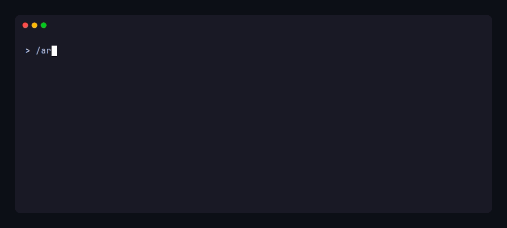
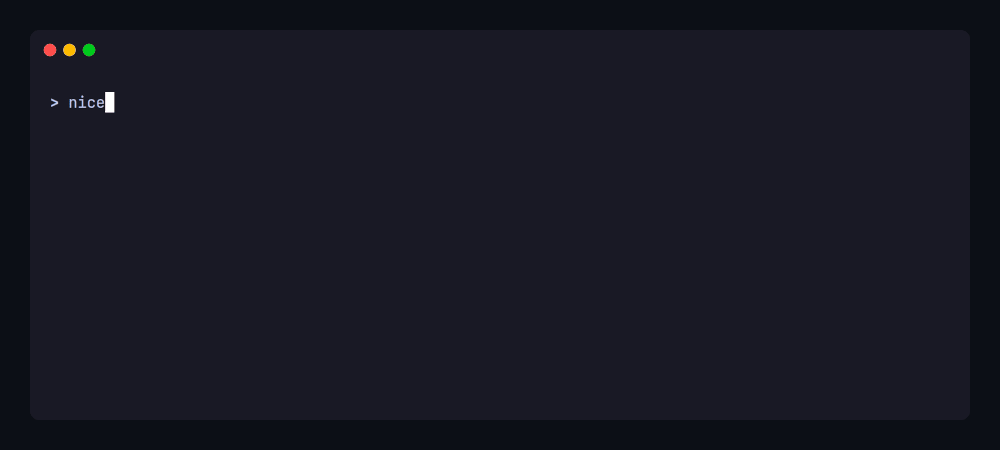

<div align="center">
  <picture>
    <source media="(prefers-color-scheme: dark)" srcset="docs/img/readme-banner-minimal-dark.svg">
    <source media="(prefers-color-scheme: light)" srcset="docs/img/readme-banner-minimal-light.svg">
    
  </picture>

[](https://www.npmjs.com/package/@arc-framework/cli)
[](https://github.com/andrewRCr/arc-framework/actions/workflows/ci.yml)
[](https://opensource.org/licenses/Apache-2.0)

</div>

ARC is a structured methodology for spec-driven development with AI agents, emphasizing
disciplined collaboration over automation. Implemented as portable markdown documents and a
CLI, it's built on the premise that better outcomes come from deliberately coupling human
judgment with agent capability, not separating them through delegation. Agentic task execution
is intentionally single-threaded — work scoped into discrete review increments that are small
enough to review meaningfully, with active developer involvement creating a tight feedback loop
that leverages complementary strengths, favoring iterative co-development over raw throughput.

The framework unifies planning, execution, and context preservation in a single system that
works with any conversational AI coding agent and any tech stack.



ARC is grounded in cognitive science research on sustained attention and emerging AI research on
context quality degradation.
[More on design&nbsp;→](https://andrewrcr.github.io/arc-framework/philosophy/)

## Overview

ARC lives in your repository as a `.arc/` directory — a shared reference for both developers
and agents. The documents aren't static context files. They're mechanical: workflows
branch on configuration values, methods define overridable contracts at trigger points,
extension points inject custom behavior at workflow boundaries, and git hooks enforce
conventions deterministically at commit time. A CLI manages the full lifecycle:
initialization, onboarding, framework updates via three-way merge, and session state
portability through git notes. Guidance is embedded where it's needed, and conventions
are enforced where they matter.

[Full documentation →](https://andrewrcr.github.io/arc-framework/) — from first
install through configuration and team coordination.

```text
.arc/
├── active/             Work in progress (task lists, PRDs, status)
├── backlog/            Future work pipeline (optional in-git planning module)
├── reference/          Stable reference material
│   ├── archive/        Completed work units (historical record)
│   ├── constitution/   Development rules (methodology + project standards)
│   ├── strategies/     Codified guidance (session management, testing, etc.)
│   └── templates/      Starting points for PRDs, plans, task lists
├── system/             Framework internals
│   ├── agent/          Agent briefings and configuration
│   ├── githooks/       Git hooks for commit validation
│   └── workflows/      Session lifecycle, task execution, work unit management
└── user/{identity}/    Personal workspace (gitignored, portable via git notes)
```

See [How ARC Works](https://andrewrcr.github.io/arc-framework/how-arc-works/) for the
complete structure and what each component does.

### Key Features

- **Single-threaded task execution with co-development.** Each task is a bounded review
  increment, small enough to review meaningfully, large enough for productive execution.
  The human is in the work during execution: steering, course-correcting, and
  writing code alongside the agent rather than reviewing a finished batch after the fact.
  Code review research shows defect detection drops from 70–90% to ~30% as review size
  grows; ARC's granularity is a direct response.
- **Configurability architecture with a CLI.** ARC's principles are non-negotiable, but
  most of how they're implemented is. Commit format, quality gate commands, triage
  thresholds, review methods, session state mechanics — all configurable conventions
  with strong defaults your team replaces when they don't fit. The CLI handles
  initialization, onboarding, framework updates via three-way merge, and session state
  portability across machines.
- **Shared context with tiered delivery.** Project specifications, development standards,
  and codified strategies give humans and agents the same understanding. Not everything
  loads at once: foundational context loads at session
  start, procedural workflows load on-demand, and reference material loads as work
  touches specific domains.
- **Session lifecycle.** Structured initialization and handoff workflows preserve working
  state, decisions, and next actions across context boundaries. Designed around research
  showing LLM performance degrades significantly as context accumulates; focused sessions
  produce better work than marathon ones.
- **A planning pipeline.** PRDs, task generation, and structured execution workflows are
  part of the core methodology. An optional project management layer adds backlogs,
  roadmap, and status tracking in-repo alongside your code, or you can integrate with
  external trackers instead.



## Design Tradeoffs

ARC optimizes for quality and maintainability over raw throughput. It's slower than fully
autonomous approaches, requires active developer engagement, and adds structure that pays
off proportional to project complexity, not over a weekend prototype. These are deliberate
design choices, not limitations.
[More on design&nbsp;→](https://andrewrcr.github.io/arc-framework/philosophy/)

## Getting Started

```bash
npx @arc-framework/cli init
```

This scaffolds `.arc/` in your project, configures git hooks, and generates agent skill
files for your platform. Run `arc join` to onboard additional developers. See the
[Getting Started guide](https://andrewrcr.github.io/arc-framework/getting-started/)
for a first session walkthrough.

## Contributing

See [CONTRIBUTING.md](CONTRIBUTING.md) for guidelines.

## License

Apache License 2.0 — see [LICENSE](LICENSE).
