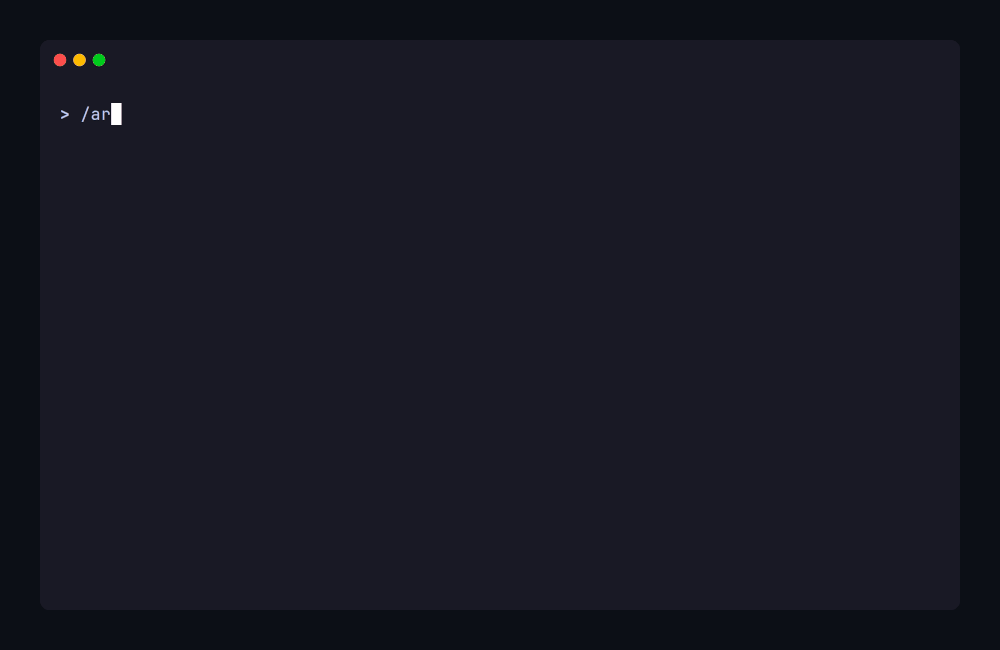

# Getting Started

ARC is a methodology, not a library — you won't call its functions or import its modules. Instead,
it creates a set of documents and workflows in your repository that structure how you and your AI
agent work together. ARC packages its user-facing workflows as
**[Skills](https://agentskills.io)** — an open standard format for giving agents new capabilities.
Each ARC skill is a user-invoked entry point for a key operational workflow: when to start a session,
when to commit, when to hand off. The agent's other workflows — task execution, quality gates,
planning — load automatically as part of the ARC instruction chain once a session is running.

This guide walks through installation, initial setup, your first session, and what the resulting
structure looks like.

## Prerequisites

- A git repository (ARC uses git for version control, hooks, and session state portability)
- An AI coding agent — ARC is built to work with any conversational agent. During beta, it's been
  primarily developed and tested with Claude Code and Codex CLI, with additional validation against
  Warp, Gemini CLI, and Copilot CLI. IDE-embedded agents (Cursor, Windsurf, Cline) are
  architecturally supported but not yet validated — if you're using one, your feedback helps close
  that gap ([file an issue](https://github.com/arc-framework/arc-framework/issues)). See
  [agent compatibility](philosophy.md#agent-compatibility) for the full compatibility spectrum.

## Installation

Install the CLI globally:

```bash
npm install -g @arc-framework/cli
```

Then initialize ARC in your project:

```bash
arc init
```

The interactive setup asks for:

- **Project name** — used in generated documents
- **AI tools** — which agents you use (generates agent-specific skill files)
- **Project management mode** — we recommend `arc-in-git` for most projects: it adds in-repo
  planning infrastructure (backlogs, roadmap, project status) that the agent can read and reason
  about directly. Choose `external` if your team already uses Jira, Linear, or similar and wants
  to keep planning there. `none` gives you the core methodology without any planning layer.
  See [The Planning Module](work-planning.md#the-planning-module) for details on each option.

This creates the `.arc/` directory, installs git hooks, generates agent skill files, and writes a
manifest for future updates.

!!! tip "Don't want to install globally?"
    You can run any command without installing: `npx @arc-framework/cli init`. Note that the
    short form `arc` only works after a global or local install — the npm package name is
    `@arc-framework/cli`, not `arc`.

### Joining an existing project

If someone else already initialized ARC in the repository:

```bash
arc join
```

This sets up your personal workspace — role, identity, and agent skills — without modifying the
shared project structure. For teams, see
[Team Coordination](reference/team-coordination.md) for the full multi-developer setup.

## Initial Setup

After `arc init` completes, it prints guidance to run the `arc-setup` skill in your agent.
[Skills](https://agentskills.io) are an open standard format supported by most AI coding tools —
they give agents capabilities and context they can load on demand. ARC generates skill files during
init that your agent discovers automatically. The invocation syntax varies by platform (slash
commands in Claude Code, `$` prefix in Codex CLI, etc.) — you invoke the skill, the agent loads its
instructions and executes the workflow.

`/arc-setup` walks you and the agent through two workflows:

1. **Verify and configure** — confirms the installation succeeded, walks through ARC's
   customization surfaces ([config values, methods, extensions](reference/configuration.md)), and
   orients you to the directory structure.
2. **Define project** — guides you through the documents that shape every session: your project
   briefing (technology stack, friction points), development rules (quality gates, testing
   requirements), and quick reference (commands, environment context).

This is a one-time collaborative walkthrough. Three of the documents you produce — your project
briefing, development rules, and quick reference — are loaded by the agent at the start of every
session. The rest (META-PRD, technical overview, roadmap, project status) are reference material
consulted during planning and architecture decisions.

## Your First Session

When setup is complete, start a fresh conversation in your agent and invoke `arc-resume` — the skill
that starts every ARC session. The agent loads a defined set of documents in order (project identity,
development rules, active work state, personal notes), then reports an orientation summary: current
branch, work state, blockers, and the suggested next action.



Since this is your first session, the agent detects there's no active work and enters discovery
mode — checking your roadmap for the next item and helping you create a PRD and task list for your
first [work unit](reference/glossary.md#work-unit). From there, the normal session rhythm takes
over: working through tasks one at a
time, each as a bounded [review increment](reference/glossary.md#review-increment) with a mandatory
stop for your review between tasks.

For the full operational model — how sessions, skills, and task execution fit together — see
[How ARC Works](how-arc-works.md).

### Committing changes

When work is ready to commit, invoke `arc-commit`. The skill handles atomic boundary analysis,
commit format guidance (conventional commits with `Context:` footers linking each commit to its
task — the default format, [customizable](reference/configuration.md#commit-discipline) to match
your team's conventions), and stages WORK-STATUS.md alongside the task list changes so project
state stays in sync.

### Ending a session

ARC sessions are designed to be shorter and more frequent than you might expect. Agent output
quality [degrades measurably](philosophy.md#why-bounded-sessions) as context accumulates, and human
attention follows the same pattern. Frequent handoffs at natural boundaries — task completion, phase
transitions, mode changes — maintain higher quality work than marathon sessions that technically fit
in the context window.

When a boundary arrives, invoke `arc-handoff`. This captures:

- **WORK-STATUS.md** — where the project stands (tracked, committed)
- **SESSION-NOTES.md** — what you were thinking (personal, gitignored)

The next session rebuilds context fresh and picks up where you left off. The handoff cost is low by
design — the value is in the reset.

## What You Get

After initialization, your repository has an `.arc/` directory with this structure:

```text
.arc/
├── active/             Work in progress (WORK-STATUS, task lists, PRDs)
│   ├── feature/        Feature work units
│   ├── technical/      Technical/infrastructure work units
│   └── incidental/     Discovered work units
├── backlog/            Future work pipeline (arc-in-git PM mode only)
├── reference/          Stable reference material
│   ├── adr/            Architecture Decision Records
│   ├── archive/        Completed work (moved from active/ after merge)
│   ├── constitution/   Development rules (ARC methodology + project standards)
│   ├── strategies/     Codified guidance (session management, planning, etc.)
│   └── templates/      Copy-ready starting points for PRDs, plans, etc.
├── system/             Framework internals
│   ├── agent/          Agent briefings and configuration
│   ├── githooks/       Git hooks for commit validation
│   └── workflows/      Session lifecycle, task execution, work unit management
└── user/{identity}/    Per-developer workspace (gitignored, portable via git notes)
```

Key files to know:

| File                        | Purpose                                                          |
| --------------------------- | ---------------------------------------------------------------- |
| `AGENT-BRIEFING.PROJECT.md` | Your project overview — technology stack, friction points        |
| `DEV-RULES.PROJECT.md`      | Your quality standards — gates, testing, code quality            |
| `QUICK-REFERENCE.md`        | Commands and environment context for your project                |
| `arc-config.yml`            | Configuration values (commit format, hooks, protection mode)     |
| `arc-methods.md`            | Overridable method implementations (commit format, triage, etc.) |
| `arc-extensions.md`         | Extension points for injecting custom workflow steps             |
| `WORK-STATUS.md`            | Current task, blockers, next action                              |

## Updating ARC

When a new version of the framework is released:

```bash
arc update
```

This updates framework files via three-way merge — your customizations to Configurable files are
preserved. See [Updating ARC](updating.md) for details on how the update system works and what's
safe to edit.

## Next Steps

- [How ARC Works](how-arc-works.md) — understand the session lifecycle, skills, and task execution
- [Philosophy](philosophy.md) — the 11 principles and the evidence behind them
- [Work Planning](work-planning.md) — the planning pipeline and task execution details
