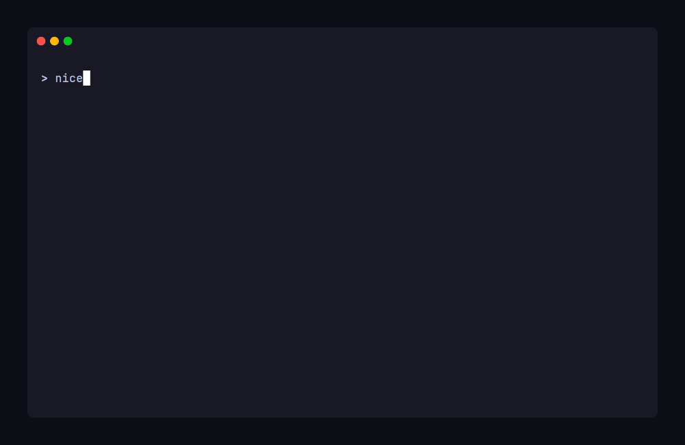
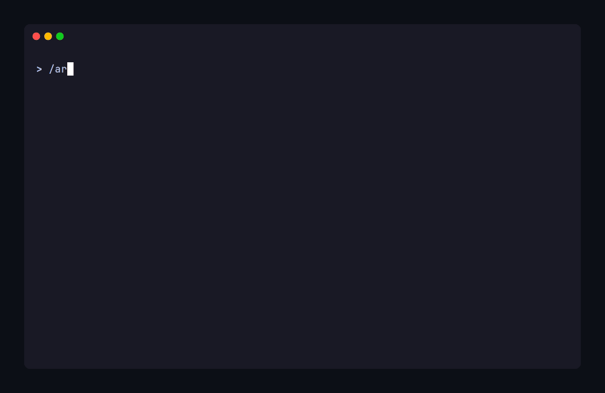
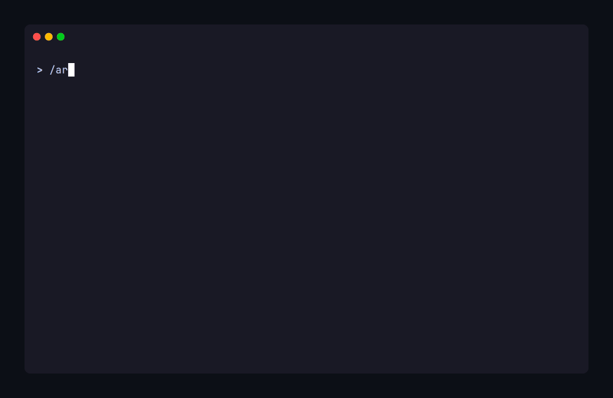

# How ARC Works

ARC lives in an `.arc/` directory in your repository. The documents inside aren't passive reference
material; they're mechanical. Workflows branch on configuration values, methods define overridable
contracts at specific trigger points, extension points inject custom behavior at workflow boundaries,
and git hooks enforce conventions deterministically at commit time.

ARC packages its user-facing workflows as **[Skills](https://agentskills.io)** — an open standard
format for giving agents new capabilities. Each ARC skill is a user-invoked entry point for a key
operational workflow. Three skills form the rhythm of every session:

- **`arc-resume`** — start a session (load context, orient to current work)
- **`arc-commit`** — commit changes (atomic boundaries, format guidance, state sync)
- **`arc-handoff`** — end a session (capture state for next time)

The invocation syntax varies by platform (slash commands in Claude Code, `$` prefix in Codex CLI,
etc.) — you invoke the skill, the agent loads its instructions and executes the workflow. The
agent's other workflows — task execution, quality gates, planning — load automatically as part of
the ARC instruction chain once a session is running. See the [Skills Reference](reference/skills.md)
for the full list and details.

## The Session Lifecycle

Work happens in bounded sessions. Each session follows a deliberate lifecycle:
establish context, execute focused work, preserve state.

### Starting a session

Invoke `arc-resume`. The agent loads project context in a defined order:

1. **Project identity** — agent briefing documents (framework orientation, project overview)
2. **Constitutional context** — development rules, strategy index, quick reference
3. **Active work state** — WORK-STATUS.md (current task, blockers, next action)
4. **Personal context** — SESSION-NOTES.md from the last handoff (if available)
5. **Task context** — current task details from the active task list
6. **Procedural content** — task execution workflow (loaded conditionally when task work exists)

Foundational context loads first. Procedural workflows and reference material load on-demand as work
triggers them. This tiered delivery keeps the agent's context focused on what's immediately relevant.

When initialization completes, the agent reports an orientation summary: the current branch, whether
the working tree is clean, active work state, any blockers, and the suggested next action.


### Working through tasks

With context loaded, you and the agent work through tasks together. The
[task execution workflow](reference/glossary.md#process-task-loop) defines the protocol — not
guidelines the agent interprets, but a structured loop with checkpoints, escalation paths, and
mandatory stops.

Each task is a *review increment* — a bounded chunk of autonomous execution between human review
points. ARC's planning workflows generate tasks at this granularity: typically a few files modified,
a few minutes of agent execution. If you're coming from approaches where the agent works for
20 minutes or longer between review points, this is a significant difference. You stay with the
work as it happens rather than reviewing a batch after the fact. The completion protocol for each
task:

1. **Test-first assessment** — before implementing, the agent evaluates whether tests should be
   written first. ARC ships a decision tree: test-first for new models, endpoints, business logic,
   and complex transformations; test-after for simple CRUD, configuration, and trivial refactoring.
   When test-first applies, execution follows vertical slices: write one test, make it pass, then
   the next.
2. The agent implements the task
3. **Quality gates** run on modified files (incremental, [Tier 1](reference/quality-gates.md))
4. The task is marked complete in the task list with an updated description reflecting what was
   actually done
5. The agent reports what was done
6. **Mandatory stop** — the agent waits for your review



You review, contribute context, and approve before the next task begins. But co-development
doesn't stop between tasks. You may also be working alongside the agent during execution:
editing files, running commands, testing ideas, or making your own commits. The agent expects
this; ARC's task execution protocol treats parallel developer activity as normal working context,
not an interruption. The mandatory stop is a checkpoint, not the only point where
[co-development](philosophy.md#core-commitments) happens.

**Quality gates are tiered.** Tier 1 (per-task) runs incremental checks on modified files. When a
task completes a coherent unit of work (the last subtask under a parent, or a standalone task
touching cross-cutting code), Tier 2 runs full-project checks plus targeted integration tests.
Tier 3 (full suite, build verification) runs at phase completion and before PRs.

**Deferred review** is available when you explicitly specify a range of tasks for continuation
(e.g., "work through tasks 5.2–5.4 while I'm away"). Quality gates still run after each task, but
the agent continues without waiting. The agent stops at the end of the specified range, or earlier
if it hits a blocker, quality gate failure, or a design decision that needs your input. The
developer defines the scope; the agent never self-invokes deferred review.

### Committing changes

When work is ready to commit, invoke `arc-commit`. The skill handles:

- **Atomic boundary analysis** — confirms all changes serve one logical concern, suggests splits if
  they don't
- **Commit format** — conventional commits with a `Context:` footer linking each commit to its
  task
- **State sync** — stages WORK-STATUS.md alongside task list changes so project state stays current



### Ending a session

Sessions are designed to be shorter and more focused than you might expect. Agent output quality
[degrades measurably](philosophy.md#why-bounded-sessions) as context accumulates, and human
attention follows the same pattern. Focused sessions that reset at natural boundaries (task
completion, phase transitions, mode changes) maintain higher quality than marathon sessions.

When a boundary arrives, invoke `arc-handoff`. This captures:

- **WORK-STATUS.md** — where the project stands (tracked, committed to git)
- **SESSION-NOTES.md** — what you were thinking (personal, gitignored)

The split is deliberate. WORK-STATUS tells any developer (or agent) where the project stands.
SESSION-NOTES tells *you* what you were thinking: decisions made, things tried, known risks.

Here's what each looks like after a handoff:

**WORK-STATUS.md** (tracked, committed):

```markdown
**Branch**: `feature/recurring-tasks`
**Task List**: `.arc/active/feature/tasks-recurring-tasks.md`
**Next Task**: Task 1.3 — Wire recurrence into task completion endpoint
**Last Completed**: Task 1.2 — Create recurrence service
**Blockers**: None
**Next Action**: Implement completion hook that triggers RecurrenceService.createNext()
```

**SESSION-NOTES.md** (personal, gitignored):

```markdown
## Completed Work

- Tasks 1.1–1.2 done and committed. Schema migration clean, service tested.
- Chose cron-parser over node-cron — lighter, parse-only (no scheduling needed).

## Additional Context

- The completion endpoint currently fires a webhook after status change.
  Recurrence creation should hook into the same event, not add a second
  code path. Check `TaskController.complete()` → `webhookService.notify()`.
- Consider: should recurrence auto-create even if the task was completed
  late? Decided yes for now — revisit if users request "skip overdue."
```



### Session state portability

SESSION-NOTES.md and other personal workspace files are gitignored by design — personal context
stays out of git history. ARC uses [git notes](https://git-scm.com/docs/git-notes) — a built-in
Git feature for attaching metadata to commits without modifying commit history — to make this state
portable without polluting the commit log:

- **Save** (`arc user save`) — serialize the user directory to a git note on HEAD
- **Load** (`arc user load`) — restore from git note, walking ancestors if needed
- **Push/pull** (`arc user push/pull`) — transport notes to/from remote

This handles multi-machine development (session context follows the branch), team handoff
(a teammate can load your session notes when picking up a branch), and disaster recovery
(gitignored files are backed up in git notes).

Push behavior is configurable: `always` (solo default — no friction), `prompt` (team default —
conscious choice per handoff), or `manual` (full control).

## When to End a Session

Three signals tell you it's time to hand off. Any one is sufficient.

**Approaching context limits.** Your platform signals when context is running low. When you see that
signal, wrap up your current work item and hand off. Don't push to the limit — leave room for the
handoff workflow itself.

**Quality degradation.** If the agent is producing lower-quality output, losing track of prior
decisions, or requiring more correction than earlier in the session — end the session. A fresh start
with good context recovery outperforms pushing through a degraded session.

**Natural stopping points.** Task completion, phase boundaries, clean commit points with no immediate
next step. Shorter, focused sessions with intentional handoffs produce better results than marathon
sessions, even when context technically permits continuation.

For practical duration guidance and the evidence behind bounded sessions, see
[Philosophy § Why Bounded Sessions](philosophy.md#why-bounded-sessions).

!!! note "Auto-compaction"
    Some platforms automatically summarize conversation history when context fills. Where possible,
    disable this. Platform compaction is a black-box summarization that doesn't understand your
    project's context priorities. With compaction disabled, the context-limit warning becomes your
    handoff trigger. When you can't disable it, consider more frequent commits and earlier handoffs.
