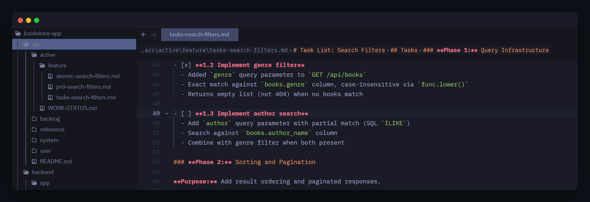

# ARC Framework

ARC is a structured methodology for spec-driven development with AI agents. It's built on a
specific premise: that focused, iterative collaboration between a developer and an agent —
co-development — produces better work than either full delegation or ad-hoc prompting. The
framework unifies planning, execution, and context preservation in a single system that works
with any conversational AI coding agent and any tech stack.



## What ARC Gives You

ARC lives in an `.arc/` directory in your repository — portable markdown documents plus a CLI
that manages the lifecycle.

```text
.arc/
├── active/             Work in progress (task lists, PRDs, status)
│   ├── feature/        Feature work units
│   ├── technical/      Technical/infrastructure work units
│   └── incidental/     Discovered work units
├── backlog/            Future work pipeline (optional planning module)
├── reference/          Stable reference material
│   ├── constitution/   Development rules (methodology + project standards)
│   ├── strategies/     Codified guidance (session management, testing, etc.)
│   └── templates/      Starting points for PRDs, plans, task lists
├── system/             Framework internals
│   ├── agent/          Agent briefings and configuration
│   ├── githooks/       Git hooks for commit validation
│   └── workflows/      Session lifecycle, task execution, work unit management
└── user/{identity}/    Personal workspace (gitignored, portable via git notes)
```

These aren't passive reference files — they form an operational system. Workflows with decision
points and quality checkpoints, configurable methods that fire at defined trigger points,
extension points for injecting custom behavior, and git hooks that enforce conventions
deterministically at commit time. This is what separates ARC from a context file: the behavior
is mechanical, consistent across sessions and agents, and maintained as a framework you update
rather than a template you fork.

**Structured workflows for the full development lifecycle.** Session initialization loads
project context in a defined order with freshness detection and state recovery. Task execution
follows a completion protocol with quality gate checkpoints and mandatory review stops between
tasks. Commit preparation analyzes atomic boundaries and keeps project state in sync. Work units
move through a managed lifecycle from planning through integration. The agent follows workflows
that branch on your project's configuration — not interpreting guidelines, executing protocols.

**A real configurability architecture.** ARC's [11 principles](philosophy.md) are
non-negotiable — everything else is a convention with a strong default your team replaces.
Config values (`arc-config.yml`) control runtime behavior like commit format and branch
protection. Methods (`arc-methods.md`) are overridable contracts at workflow trigger points —
swap in your commit format, triage thresholds, test-first rules, or quality gate commands
without touching the workflows that call them. Extension points (`arc-extensions.md`) inject
custom steps at workflow boundaries. Git hooks enforce commit discipline regardless of which
agent or human is committing.

Beyond adapting ARC's defaults, the framework provides structure for your own content. Project
strategies, project workflows, domain-specific development rules, and project-scoped templates
live alongside framework files and carry the same weight when the agent is working in those
domains. ARC gives you the scaffolding; you populate it as your project's patterns emerge.

**A maintained framework, not a template.** Every `.arc/` file has a
[classification](updating.md) — framework, configurable, scaffolded — that determines how
`arc update` treats it. Framework files update cleanly, configurable files three-way merge
preserving your changes, scaffolded files are never touched. Your methods, extensions, and
project standards survive across framework versions.

## The CLI

[`@arc-framework/cli`](https://www.npmjs.com/package/@arc-framework/cli) manages the lifecycle:

- **`arc init`** — initialize ARC in a project. `--reconfigure` to change settings later.
- **`arc join`** — join an existing ARC project (role, identity, agent skills).
- **`arc update`** — update framework files via three-way merge, preserving your customizations.
- **`arc user sync`** — session state portability via git notes.

## Documentation

| Section                               | What You'll Find                                                     |
|---------------------------------------|----------------------------------------------------------------------|
| [Getting Started](getting-started.md) | Install, first session walkthrough, what the setup produces          |
| [How ARC Works](how-arc-works.md)     | Session lifecycle, skills, task execution, committing, handoffs      |
| [Philosophy](philosophy.md)           | The 11 principles, evidence base, where ARC fits                     |
| [Work Planning](work-planning.md)     | The planning pipeline from idea to task list, work organization      |
| [Updating ARC](updating.md)           | What `arc update` does, file classifications, what's safe to edit    |
| [Reference](reference/index.md)       | Configuration, quality gates, skills, team coordination, glossary    |
| [FAQ](faq.md)                         | Common questions about design choices, agent compatibility, usage    |
| [Contributing](contributing.md)       | How to contribute — setup, commit conventions, quality standards     |
